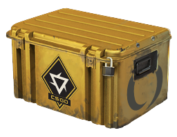

# CS:GO Case Simulator
### Browser Case Opening Simulator CS:GO 

<p style="width: 100%; text-align: center; margin-top: 2rem">
    
</p>

***

## **Features:**
* ### **All CS:GO Skins** - over **1500** weapon skins, including rare patterns such as sapphire, ruby, etc.
* ### **All Cases and Collections** - **74** original cases from different eras of Counter-Strike! From **Cobblestone Souvenirs** to latest **Revolution Case**!
* ### **Real Chances of Cases** - all chances are as close as possible to real game chances
* ### **A Lot of Casino modes** - play many modes such as **Upgrader** / **Craft** / **Contract** etc.

# How to compile?
To compile application in the `production mode`

``` sh
npm run build
```

Start in the `developper mode` with source mapping and watch changes

``` sh
npm run start
```

P.S.: Standart React methods

<p style="width: 100%; text-align: center; margin-top: 2rem">
    
</p>